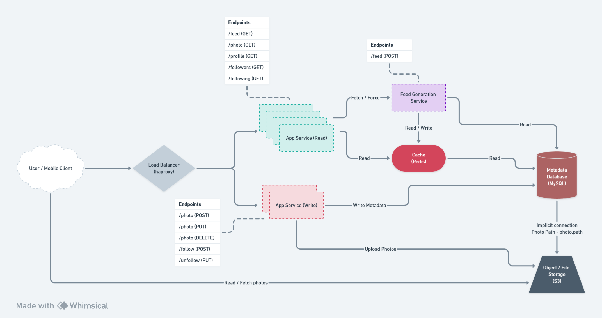

# System Design - Instagram



<b>NOTE:</b>

<i>None of this code is error tested and should not be replicated as is in a production environment. It is purely to check the functionality of this system design.</i>

### Postman Collection:

Import the file `System Design - Instagram.postman_collection.json` into the Postman software.

### Running The Project

From each of the respective `read-api`, `write-api`, and `feed-generation-service` folders, run the following `docker build` commands.

```bash
docker build -t read-api .
docker build -t write-api .
docker build -t feed-generation-service .
```

From the `root` folder run the following docker-compose command.

```bash
docker compose up
```

From the `client` folder run the following commands, and open the client on [http://localhost:3000](http://localhost:3000)

```bash
npm install
or
yarn install
or
pnpm install

npm dev
or
yarn dev
or
pnpm dev
```
